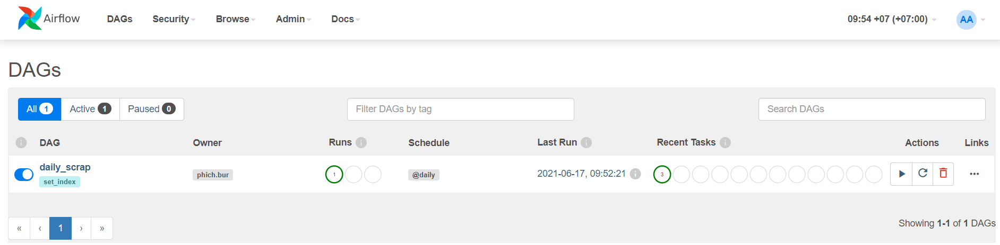
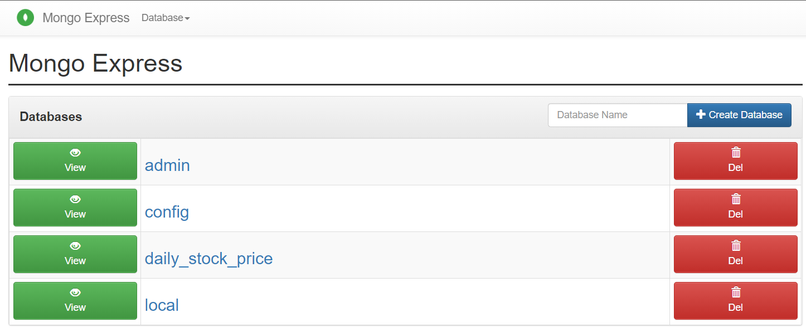

# Set-Index-Daily-Stock-Price
Get daily set index stock price and write it to mongodb
# Setup and start
Run the below commands in the project directory.
Need to install docker, docker compose

- Install a requirements
```bash
pip install -r requirements.txt
```
- Build the airflow and compose up
```bash
docker-compose up --build airflow-init
docker-compose up -d
```
- Start daily scrap on airflow at http://localhost:8080/
Scrap!


- Then you can check the data in mongo-express at http://localhost:8081/



# Follow Me On

- [LinkedIn](https://www.linkedin.com/in/phich-buranchai-9660141b7/)

# Appendix

- [scrapy tutorial](https://docs.scrapy.org/en/latest/intro/tutorial.html)
- [pymongo tutorial](https://pymongo.readthedocs.io/en/stable/tutorial.html)